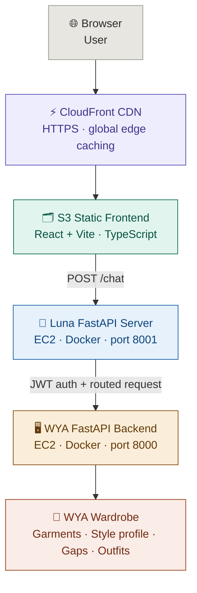

<div align="center">


# Luna — Conversational AI Stylist


**A chat interface that lets you talk to your wardrobe in plain English.**
Luna connects to [WYA](https://github.com/ria0304/WYA-Whats-Your-Aesthetic)'s fashion intelligence API so before you say a word, it already knows what you own, what your aesthetic is, and what you're missing.

> **Live →** http://luna-stylist.s3-website.ap-south-1.amazonaws.com/
>
> ⚠️ **Status:** Requires a WYA account. The WYA EC2 backend is currently paused to manage AWS costs — API features (wardrobe, outfit matching, gap analysis) are offline. Frontend and Luna server are live. To run the full stack, see [Run Locally](#run-locally).

</div>

---

## Problem Statement

Wardrobe apps show you what you own. Fashion apps show you what's trending. Neither one lets you just *ask*.

**1. You can't query your own closet.**
Finding something to wear means physically digging through your wardrobe or scrolling through a grid of thumbnail photos. There's no way to say "show me everything navy" or "what do I have for a formal dinner?" and get a real answer.

**2. Style insights are buried in dashboards.**
WYA builds a rich style profile for every user — aesthetic type, style vectors, wardrobe gaps — but surfacing that data requires navigating menus. Most users never reach it.

**3. Outfit suggestions have no context.**
Generic recommendation engines don't know you had a job interview last Tuesday or that you're packing for a beach trip. Natural language does.

Luna solves all three. It's a conversational layer on top of WYA that turns your wardrobe into something you can actually talk to.

---

## What You Can Ask

| Message | What Luna does |
|---|---|
| *"What should I wear to college tomorrow?"* | Generates real outfits from your actual wardrobe |
| *"Show all my black tops"* | Natural language search across your garments |
| *"What am I missing for winter?"* | Gap analysis powered by WYA's wardrobe intelligence |
| *"Why am I a minimalist?"* | Your Style DNA explained in plain English |
| *"Give me something casual for the weekend"* | Occasion-filtered outfit suggestions |

---

## How It Works

Luna has two layers — a React frontend and a Python backend. The frontend captures your message, the backend classifies intent and routes to the right WYA endpoint, and the response comes back as a chat reply.

No wardrobe data lives in Luna. WYA is the brain. Luna is the mouth.

```
User message
    ↓
Luna React frontend
    ↓
Luna FastAPI server  (port 8001 · EC2 · Docker)
    ↓
Intent classifier  (regex + pattern matching → intent type)
    ↓
Route to WYA endpoint  (wardrobe / outfits / style / gaps)
    ↓
Format API response
    ↓
Chat reply
```

### Intent Classification

The classifier (`server/intent.py`) maps natural language to one of five intent types before any WYA API call is made:

| Intent | Example triggers | WYA endpoint |
|---|---|---|
| `outfit_suggestion` | "what should I wear", "outfit for", "dress me" | `POST /outfits/generate` |
| `wardrobe_search` | "show me", "find my", "all my [color/type]" | `GET /wardrobe/search` |
| `gap_analysis` | "what am I missing", "what do I need" | `GET /wardrobe/gaps` |
| `style_explanation` | "why am I", "what's my aesthetic", "explain my style" | `GET /style/profile` |
| `general` | anything else | Smart reply fallback — no WYA call |

---

## Architecture



**Deployment**
- Frontend → S3 + CloudFront (HTTPS, CDN cached, global)
- Luna server → Docker on WYA's EC2 `c7i-flex.large` (ap-south-1), port 8001
- Auth → JWT tokens from WYA's `/auth/login` endpoint, proxied through Luna server
- CI/CD → GitHub Actions (push to `main` → frontend to S3 + server to EC2, parallel jobs)

---

## Project Structure

```
luna-stylist/
├── index.html
├── vite.config.ts
├── tsconfig.json
├── package.json
├── .env.example
│
├── .github/
│   └── workflows/
│       └── deploy.yml          # CI/CD → S3 (frontend) + EC2 (server), parallel
│
├── server/                     # Luna Python backend
│   ├── main.py                 # FastAPI app — /health, /auth/login, /chat
│   ├── intent.py               # Regex intent classifier
│   ├── smart_reply.py          # Fallback replies for general messages
│   ├── requirements.txt
│   └── Dockerfile              # Runs on port 8001
│
└── src/
    ├── main.tsx                # App entry point
    ├── index.css               # Global styles
    ├── App.tsx                 # Root component + auth gate
    │
    ├── views/
    │   ├── Login.tsx           # WYA login screen
    │   └── Chat.tsx            # Main chat interface
    │
    ├── components/
    │   ├── ChatWindow.tsx      # Message list renderer
    │   ├── ChatInput.tsx       # Text input + send button
    │   ├── IntentBadge.tsx     # Debug overlay — shows classified intent
    │   └── OutfitCard.tsx      # Outfit result card component
    │
    ├── services/
    │   ├── api.ts              # Luna server API calls
    │   ├── auth.ts             # JWT token storage + session helpers
    │   ├── intent.ts           # Client-side intent hint (legacy)
    │   └── smartReply.ts       # Client-side fallback replies (legacy)
    │
    └── types/
        └── index.ts            # Shared TypeScript types + API response mappers
```

---

## Tech Stack

**Frontend**
- React + TypeScript + Vite
- Tailwind CSS
- Deployed on AWS S3 + CloudFront (HTTPS)

**Backend (Luna server)**
- FastAPI (Python)
- httpx — async WYA API calls
- Regex intent classifier — natural language → WYA route
- Smart reply fallback — handles general conversation without hitting WYA
- Dockerized, deployed on AWS EC2 (ap-south-1), port 8001

**AWS Infrastructure**
- EC2 `c7i-flex.large` (ap-south-1) — Docker containers for both WYA (port 8000) and Luna (port 8001)
- S3 + CloudFront — static frontend with HTTPS and CDN caching
- CI/CD — GitHub Actions, two parallel jobs on push to `main`

---

## Run Locally

**Frontend**
```bash
git clone https://github.com/ria0304/luna-stylist
cd luna-stylist
npm install
cp .env.example .env
# Set VITE_LUNA_API_URL to your Luna server URL
npm run dev
```

**Luna server**
```bash
cd server
pip install -r requirements.txt
cp .env.example .env
# Set WYA_API_URL to your WYA backend URL
uvicorn main:app --reload --port 8001
```

> Luna requires a running WYA backend. See [WYA — Run Locally](https://github.com/ria0304/WYA-Whats-Your-Aesthetic#run-locally) to spin up the API.
>
> You also need a WYA account — Luna has no standalone auth. It authenticates directly against your WYA wardrobe.

---

## Deployment

Pushes to `main` automatically trigger two parallel jobs via GitHub Actions:

**deploy-frontend**
1. Builds the React app (`npm run build`)
2. Syncs `dist/` to S3
3. Invalidates CloudFront cache

**deploy-server**
1. SSHs into EC2
2. Pulls latest from `main`
3. Rebuilds the Docker image from `server/`
4. Restarts the `luna` container on port 8001

**GitHub Secrets required:**

| Secret | Description |
|---|---|
| `AWS_ACCESS_KEY_ID` | IAM credentials for S3 + CloudFront |
| `AWS_SECRET_ACCESS_KEY` | IAM credentials |
| `LUNA_CLOUDFRONT_DISTRIBUTION_ID` | CloudFront distribution ID |
| `VITE_WYA_API_URL` | WYA backend base URL (injected at build time) |
| `VITE_LUNA_API_URL` | Luna server URL (injected at build time) |
| `EC2_HOST` | EC2 instance IP |
| `EC2_SSH_KEY` | EC2 SSH private key |

**On EC2, create `~/luna.env` manually before first deploy:**
```bash
WYA_API_URL=http://<EC2-IP>:8000
ALLOWED_ORIGINS=http://luna-stylist.s3-website.ap-south-1.amazonaws.com
```

---

## Related

[WYA — What's Your Aesthetic](https://github.com/ria0304/WYA-Whats-Your-Aesthetic) — the full wardrobe intelligence platform Luna connects to. Computer vision, style profiling, outfit matching, sustainability scoring — all the heavy lifting happens here.

---

*Luna is part of the WYA ecosystem. It does not store any wardrobe data independently.*
